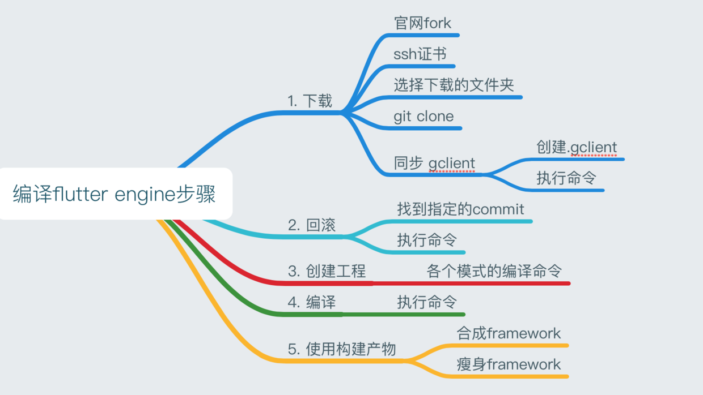

# 深入理解flutter原理（一）
## 1 从编译一个 `engine` 开始

## 1.1 首先，你需要翻墙，最好保证整个过程中可以访问国外资源
## 1.2 从官网fork工程到自己工程，https://github.com/flutter/engine
## 1.3 安装depot_tools
### 克隆depot_tools仓库， 获取gclient命令，执行如下：
```
git clone https://chromium.googlesource.com/chromium/tools/depot_tools.git
```
### 设置环境变量，编辑 `~/.bashrc` 或者 `~/.zshrc`，添加如下内容：
```
export PATH=$PATH:/path/to/depot_tools
```
## 1.4 安装Homebrew
```
/usr/bin/ruby -e "$(curl -fsSL https://raw.githubusercontent.com/Homebrew/install/master/install)"
````
## 1.5 安装ant和ninja

```
brew install ant
brew install ninja
```

## 1.6 创建一个空文件夹，并在目录下新建`.gclient`配置文件，文件内容如下：
```
solutions = [
  {
    "managed": False,
    "name": "src/flutter",
    //此处url需改为真实的个人或者公司引擎地址
    "url": "https://github.com/flutter/engine.git",
    "custom_deps": {},
    "deps_file": "DEPS",
    "safesync_url": "",
  },
]
```

## 1.7 获取Flutter所依赖的所有源代码，时间超长，大概一个半小时
```
gclient sync
```

## 1.8 查看flutter engine 版本
```
flutter --version
```

### 可以看到engine的commit为3d37d39d95

```
Flutter 1.13.10-pre.26 • channel master • https://github.com/flutter/flutter.git
Framework • revision ab36346af6 (9 weeks ago) • 2020-01-11 14:20:05 -0500
Engine • revision 3d37d39d95
Tools • Dart 2.8.0 (build 2.8.0-dev.0.0 395daaa3ec)
```

## 1.9 同步flutter engine 版本
```
cd src/flutter
git checkout 3d37d39d95
```

### 再次执行命令
```
gclient sync
```

## 1.10 创建engine工程
* 生成Host编译产物存放文件
```
./flutter/tools/gn --runtime-mode debug --unoptimized
```
* 生成iOS模拟器工程
```
./flutter/tools/gn --ios --simulator --unoptimized
```

## 1.11 编译engine工程
```
 ninja -C out/ios_debug_sim_unopt && ninja -C out/host_debug_unopt
```

## 1.12 使用engine
* 在工程中使用
```
flutter run --local-engine-src-path=/Users/zhiruiou/desktop/flutter_engine/engine/src --local-engine=ios_debug_sim_unopt
```
* 直接拷贝替换掉flutter目录里面的engine
```
/Users/zhiruiou/flutter/bin/cache/artifacts/engine 
```

# 参考文档
### [手把手教你编译Flutter engine](https://juejin.im/post/5c24acd5f265da6164141236)
### [搭建Flutter Engine源码编译环境](http://gityuan.com/2019/08/03/flutter_engine_setup/#13-%E5%AE%89%E8%A3%85homebrew)